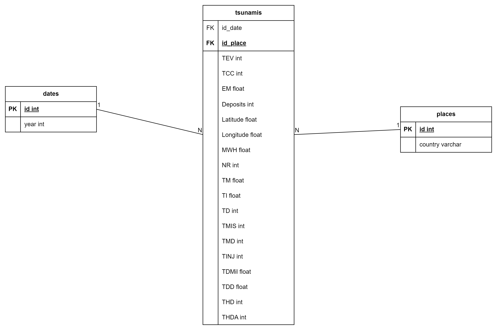

# Manual Tecnico
## Modelo de Datos
)

### Tablas de Dimensiones
#### Places
| Columna | Tipo | Descripcion |
| --- | --- | --- |
| id | int | Identificador unico |
| country | varchar | Pais |

#### Dates
| Columna | Tipo | Descripcion |
| --- | --- | --- |
| id | int | Identificador unico |
| year | int | Año |

### Tabla de Hecho: tsunami
| Columna | Tipo | Descripcion |
| --- | --- | --- |
| id_date | int | Identificador de fecha |
| id_place | int | Identificador de lugar |
| TEV | int | Tsunami Event Validity |
| TCC | int | Tsunami Cause Code |
| EM | float | Earthquake Magnitude |
| Deposits | int | Depositos |
| Latitude | float | Latitud |
| Longitude | float | Longitud |
| MWH | float | Maximum Water Height |
| NR | int | Number of Runups |
| TM | float | Tsunami Magnitude |
| TI | float | Tsunami Intensity |
| TD | int | Total Deaths |
| TMIS | int | Total Missing |
| TMD | int | Total Missing Description |
| TINJ | int | Total Injuries |
| TDMil | float | Total Damage in Millions |
| TDD | float | Total Damage Description |
| THD | float | Total Houses Destroyed |
| THDA | float | Total Houses Damaged |

## Menu
```Python
def menu():
    print("Seleccione una opción:")
    print("1. Borrar modelo")
    print("2. Crear modelo")
    print("3. Extraer información")
    print("4. Cargar informacion")
    print("5. Realizar consultas")
    print("6. Salir")
    
    opcion = input("Opción: ")
    
    if opcion == "1":
        borrar_modelo()
    elif opcion == "2":
        crear_modelo()
    elif opcion == "3":
        extraer_informacion()
    elif opcion == "4":
        cargar_informacion()
    elif opcion == "5":
        realizar_consultas()
    elif opcion == "6":
        print("Saliendo...")
        return
    else:
        print("Opción no válida")
    menu()
```
En esta funcion se muestra un menu con las opciones de borrar modelo, crear modelo, extraer informacion, cargar informacion, realizar consultas y salir. Se ejecuta la opcion seleccionada y se vuelve a mostrar el menu.

## Borrar Modelo
```Python
def borrar_modelo():
    print("Borrando modelo...")
    
    try:
        cursor = conexion.cursor()
        cursor.execute("DROP TABLE tsunami")
        cursor.execute("DROP TABLE dates")
        cursor.execute("DROP TABLE places")
        cursor.execute("DROP TABLE tempTsunami")
        cursor.commit()
        cursor.close()
        print("Modelo borrado")
    except Exception as e:
        print("Error al borrar el modelo") 
```
En esta funcion se ejecutan las sentencias SQL para borrar las tablas de la base de datos.

## Crear Modelo
```Python
def crear_modelo():
    print("Creando modelo...")
    
    try:
        cursor = conexion.cursor()
        cursor.execute("CREATE TABLE dates (id INT IDENTITY(1,1), year INT, month INT, day INT, hour int, minute INT, second float, PRIMARY KEY (id))")
        cursor.execute("CREATE TABLE places (id INT IDENTITY(1,1), country VARCHAR(50), location VARCHAR(50), PRIMARY KEY (id))")
        cursor.execute('''CREATE TABLE tsunami (TEV INT, TCC INT, EM FLOAT, Deposits INT, Latitude FLOAT, Longitude FLOAT, MWH FLOAT, NR INT, TM FLOAT, TI FLOAT, TD INT, TMIS INT, TMD INT, TINJ INT, TDMil FLOAT, TDD FLOAT, THD INT, THDA INT, id_date INT, id_place INT, FOREIGN KEY (id_date) REFERENCES dates(id), FOREIGN KEY (id_place) REFERENCES places(id))''')
        query = '''CREATE TABLE tempTsunami (
            year varchar(4), 
            month varchar(4),
            day varchar(4),
            hour varchar(4),
            minute varchar(4),
            second varchar(4),
            TEV varchar(50),
            TCC varchar(50),
            EM varchar(50),
            Deposits varchar(50),
            Latitude varchar(50),
            Longitude varchar(50),
            MWH varchar(50),
            NR varchar(50),
            TM varchar(50),
            TI varchar(50),
            TD varchar(50),
            TMIS varchar(50), 
            TMD varchar(50),
            TINJ varchar(50),
            TDMil varchar(50),
            TDD varchar(50),
            THD varchar(50),
            THDA varchar(50),
            COUNTRY varchar(50),
            Location varchar(70))'''
        cursor.execute(query)
        cursor.commit()
        cursor.close()
        
        print("Modelo creado")
    except Exception as e:
        print("Error al crear el modelo",e)
```
En esta funcion se ejecutan las sentencias SQL para crear las tablas de la base de datos. Se crea una tabla para las fechas (dates), una para los lugares (places) y una para los datos de los tsunamis (tsunamis). Ademas se crea una tabla temporal (tempTsunami) para cargar los datos del archivo CSV.

## Extraer Informacion
```Python
def extraer_informacion():
    path = input("Ingrese el path del archivo: ")
    
    print("Extrayendo información...")
    
    with open(path, "r") as file:
        lines = csv.reader(file)
        header = next(lines)
        for line in lines:
            try:
                query = "INSERT INTO tempTsunami VALUES (?,?,?,?,?,?,?,?,?,?,?,?,?,?,?,?,?,?,?,?,?,?,?,?,?,?)"
                cursor = conexion.cursor()
                cursor.execute(query,line)
                cursor.commit()
                cursor.close()
            except Exception as e:
                continue
    
    print("Información extraída")
```
En esta funcion se extrae la informacion del archivo CSV y se carga en una tabla temporal llamada tempTsunami  de la base de datos.

## Cargar Informacion
```Python
def cargar_informacion():
    print("Cargando información...")
    
    try:
        cursor = conexion.cursor()

        ### Cargar años excepto los nulos o vacios
        cursor.execute('''INSERT INTO dates(year) SELECT DISTINCT cast(t.year as int)
                       FROM tempTsunami as t
                       WHERE (t.year IS NOT NULL AND t.year != '') ''')
        
        ### Cargar paises excepto los nulos o vacios
        cursor.execute('''INSERT INTO places(country) SELECT DISTINCT t.country
                        FROM tempTsunami as t
                        WHERE (t.country IS NOT NULL AND t.country != '')''')
        
        ### Cargar datos de los tsunamis aquellos que tengan año y pais no haya sido ingresado a las tablas anteriores
        cursor.execute('''INSERT INTO tsunami(TEV, TCC, EM, Deposits, Latitude, Longitude, MWH, NR, TM, TI, TD, TMIS, TMD, TINJ, TDMil, TDD, THD, THDA, id_date, id_place)
                        SELECT cast(t.TEV as int), cast(t.TCC as int), cast(t.EM as float), cast(t.Deposits as int), cast(t.Latitude as float), cast(t.Longitude as float), cast(t.MWH as float), cast(t.NR as int), cast(t.TM as float), cast(t.TI as float), cast(t.TD as int), cast(t.TMIS as int), cast(t.TMD as int), cast(t.TINJ as int), cast(t.TDMil as float), cast(t.TDD as int), cast(t.THD as int), cast(t.THDA as int), d.id, p.id
                        FROM tempTsunami as t
                        JOIN dates as d ON cast(t.year as int) = d.year 
                        JOIN places as p ON t.country = p.country''')
        cursor.commit()
        cursor.close()
        
        print("Información cargada")
    except Exception as e:
        print("Error al cargar la información",e)
```
En esta funcion se cargan los datos de la tabla temporal tempTsunami a las tablas de la base de datos. Se cargan las fechas, los lugares y los datos de los tsunamis.

## Realizar Consultas
### Menu
```Python
def realizar_consultas():
    print("Seleccione una opción:")
    print("1. Count de Tablas")
    print("2. Tsunamis por año")
    print("3. Tsunamis por pais")
    print("4. Promedio de daño por pais")
    print("5. Top 5 paises con mas muertes")
    print("6. Top 5 años con mas muertes")
    print("7. Top 5 años con mas tsunamis")
    print("8. Top 5 paises con mayor numero de casas destruidas")
    print("9. Top 5 paises con mayor numero de casas dañadas")
    print("10. Promedio de altura de olas por pais")
    
    opcion = input("Opción: ")
    
    print("Realizando consultas...")
    buffer = ""
    
    if opcion == "3":
        consulta3()
        return
    elif opcion == "1":
        buffer = consulta1() + "\n"
    elif opcion == "2":
        buffer = consultaDual('''SELECT year, count(*) as no_tsunamis FROM dates 
                       JOIN tsunami ON dates.id = tsunami.id_date 
                       GROUP BY year ORDER BY year ASC''',2) + "\n"
    elif opcion == "4":
        buffer = consultaDual('''SELECT country, avg(TDMil) as total_damage FROM places 
                       JOIN tsunami ON places.id = tsunami.id_place 
                       GROUP BY country''',4) + "\n"
    elif opcion == "5":
        buffer = consultaDual('''SELECT TOP 5 country, sum(TD) as total_Deaths FROM places 
                       JOIN tsunami ON places.id = tsunami.id_place 
                       GROUP BY country ORDER BY total_Deaths DESC''',5) + "\n"
    elif opcion == "6":
        buffer = consultaDual('''SELECT TOP 5 year, sum(TD) as total_Deaths FROM tsunami
                       JOIN dates ON dates.id = tsunami.id_date 
                       GROUP BY year ORDER BY total_Deaths DESC''',6) + "\n"
    elif opcion == "7":
        buffer = consultaDual('''SELECT TOP 5 year, count(*) as total_Tsunami FROM tsunami
                       JOIN dates ON dates.id = tsunami.id_date 
                       GROUP BY year ORDER BY total_Tsunami DESC''',7) + "\n"
    elif opcion == "8":
        buffer = consultaDual('''SELECT TOP 5 country, sum(THD) as total_THD FROM tsunami
                       JOIN places ON places.id = tsunami.id_place 
                       GROUP BY country ORDER BY total_THD DESC''',8) + "\n"
    elif opcion == "9":
        buffer = consultaDual('''SELECT TOP 5 country, sum(THDA) as total_THDA FROM tsunami
                       JOIN places ON places.id = tsunami.id_place 
                       GROUP BY country ORDER BY total_THDA DESC''',9) + "\n"
    elif opcion == "10": 
        buffer = consultaDual('''SELECT country, avg(MWH) as max_water FROM tsunami
                       JOIN places ON places.id = tsunami.id_place 
                       GROUP BY country''',10) + "\n"
    
    f = open("consultas.txt", "w")
    f.write(buffer)
    f.close()
    
    consulta3()
```
En esta funcion se muestra un menu con las opciones de consulta. Se ejecuta la consulta seleccionada y se guarda en un archivo llamado consultas.txt.

### Consulta 1
```Python
def consulta1():
    buffer = "Consulta 1\n"
    try:
        cursor = conexion.cursor()
        cursor.execute("SELECT count(*) FROM tempTsunami")
        rows = cursor.fetchall()
        buffer += f"No. tempTsunami: {rows[0][0]} \n"
        cursor.execute("SELECT count(*) FROM tsunami")
        rows = cursor.fetchall()
        buffer += f"No. tsunamis: {rows[0][0]} \n"
        cursor.execute("SELECT count(*) FROM dates")
        rows = cursor.fetchall()
        buffer += f"No. dates: {rows[0][0]}\n"
        cursor.execute("SELECT count(*) FROM places")
        rows = cursor.fetchall()
        buffer += f"No. places: {rows[0][0]}\n"
        cursor.close()
        return buffer
    except Exception as e:
        return "Error al realizar la consulta  \n"
```
En esta funcion se realiza la consulta 1 que consiste en contar el numero de registros de las tablas tempTsunami, tsunami, dates y places.

### ConsultaDual
```Python
def consultaDual(query, i):
    buffer = f"Consulta {i}\n"
    try:
        cursor = conexion.cursor()
        cursor.execute(query)
        rows = cursor.fetchall()
        for row in rows:
            buffer += f"{row[0]}: {row[1]}\n"
        cursor.close()
        return buffer
    except Exception as e:
        return f"Error al realizar la consulta {i} \n"
```
En esta funcion se realiza una consulta que devuelve dos columnas. Se ejecuta la consulta y se guardan los resultados en un buffer.

### Consulta 3
```Python
def consulta3():
    buffer = ""
    try:
        cursor = conexion.cursor()
        cursor.execute('''SELECT DISTINCT country FROM places''')
        rows = cursor.fetchall()
        for row in rows:
            buffer += "Pais"
            cursor.execute(f'''SELECT year FROM dates
                            JOIN tsunami ON dates.id = tsunami.id_date
                            JOIN places ON places.id = tsunami.id_place
                            WHERE country = '{row[0]}' ORDER BY year''')
            years = cursor.fetchall()
            bufferYears = row[0]
            for i in range(len(years)):
                buffer+= f",Año {i+1}"
                bufferYears += f",{years[i][0]}"
            buffer += f"\n{bufferYears}\n"
            
        cursor.close()
        f = open("consulta3.csv", "w")
        f.write(buffer)
        f.close()
    except Exception as e:
        print("Error al realizar la consulta 3 \n")
```
En esta funcion se realiza la consulta 3 que consiste en mostrar los años en los que se presentaron tsunamis por pais. Se ejecuta la consulta y se guardan los resultados en un archivo llamado consulta3.csv.